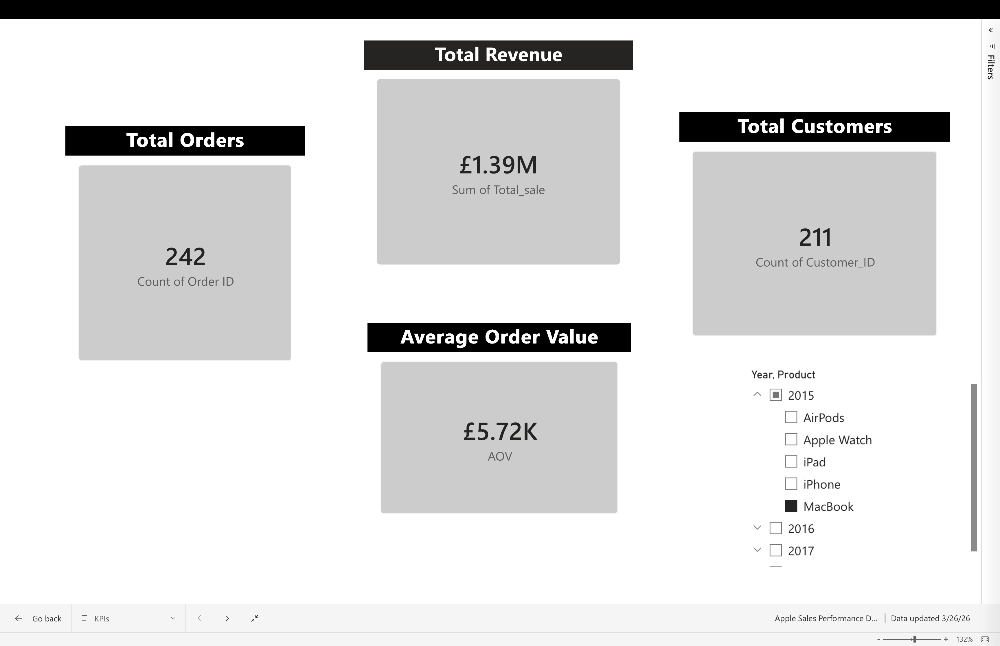
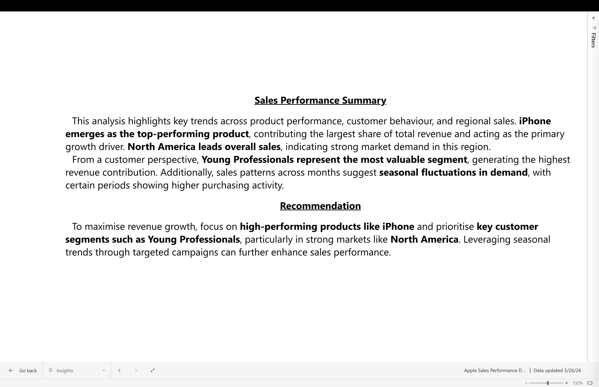

🚀 Apple Sales Analytics Project
This project demonstrates an end-to-end data analytics workflow, including data cleaning, transformation, database integration, SQL analysis, and dashboard visualization.

📊 Project Overview
The objective of this project is to analyze sales data and generate business insights on:
    Product performance
    Customer behaviour
    Regional trends
    Revenue growth
The project simulates a real-world analytics pipeline from raw data to decision-making.

🛠 Tools & Technologies
    Python (Pandas, NumPy, Matplotlib)
    Oracle APEX (Database & SQL)
    Power BI (Dashboard & Visualization)

🔄 Data Pipeline
The project follows a complete data pipeline:
    Data Cleaning
    Handled missing values
    Standardised formats (dates, postcodes)
    Removed inconsistencies
    Data Transformation
    Feature engineering (Year, Month, Quarter)
    Product-category mapping
    Revenue and pricing calculations
    Data Consistency
    Resolved conflicting customer attributes (e.g., inconsistent ages)
    Ensured logical relationships between fields
    Data Aggregation
    Consolidated duplicate order entries
    Structured dataset for analysis

🗄 Database Integration
The cleaned dataset was loaded into an Oracle database using Oracle APEX.
🔹 Staging Table
    APPLE_SALES_CLEAN
Used as an intermediate table for data loading and transformation.
🔹 Normalized Tables
The dataset was normalized into the following relational structure:
    CUSTOMERS
    PRODUCTS
    ORDERS
    ORDER_DETAILS
This improved:
    Data integrity
    Reduced redundancy
    Query performance

💾 SQL Analysis
SQL queries were used to analyze the dataset, including:
    Total revenue calculation
    Revenue by product and region
    Customer segment analysis
    Top customers by revenue
    Monthly revenue trends
I have added the query files in the sql folder.
    
├── sql/
│   ├── create_table.sql
│   ├── analysis_queries.sql
│   └── normalized_analysis_queries.sql

📊 Dashboard
An interactive Power BI dashboard was created using the cleaned dataset.
The dashboard includes:
    Total Revenue, Orders, Customers, and AOV
    Revenue by Product
    Revenue by Region
    Customer Segment Analysis
    Monthly Revenue Trends
The following visuals highlight key insights derived from the dataset:
    dashboard/
    ├── 
    ├── 
    ├── 
    ├── 
    ├── 
    ├── 

📈 Key Insights
    iPhone is the top-performing product, contributing the majority of total revenue.
    North America generates the highest revenue, indicating strong market demand.
    Young Professionals represent the most valuable customer segment.
    Sales show seasonal trends across different months.
    Revenue is concentrated among a smaller group of high-value customers.

💡 Business Recommendation
    Focus on high-performing products like iPhone and target key customer segments in strong regions such as North America. Leveraging seasonal trends can further optimise revenue growth.

📁 Project Structure

Apple_analytics_project/
├── data/
│   ├── raw/
│   └── processed/
├── scripts/
│   ├── pipeline.py
│   ├── analysis.py
│   └── visuals.py
├── dashboard/
│   ├── KPIs.png
    ├── Revenue by Product.png
    ├── Revenue by City.png
    ├── Monthly Trend.png
    ├── Customer Segment.png
    ├── Insights.png
├── sql/
│   ├── create_table.sql
│   ├── analysis_queries.sql
│   └── normalized_analysis_queries.sql
├── main.py
├── requirements.txt
└── README.md

💼 Skills Demonstrated
    Data Cleaning & Preprocessing
    Feature Engineering
    Data Consistency Handling
    SQL & Database Design
    Database Normalization
    Data Analysis & Aggregation
    Data Visualisation (Power BI)
    Business Insight Generation

🧠 Summary
This project demonstrates the ability to build a complete data analytics solution, combining Python, SQL, and Power BI to transform raw data into actionable business insights.